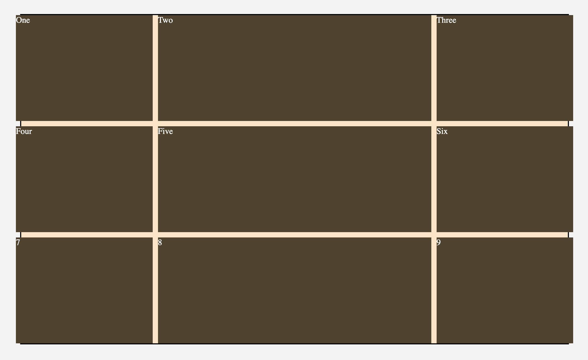
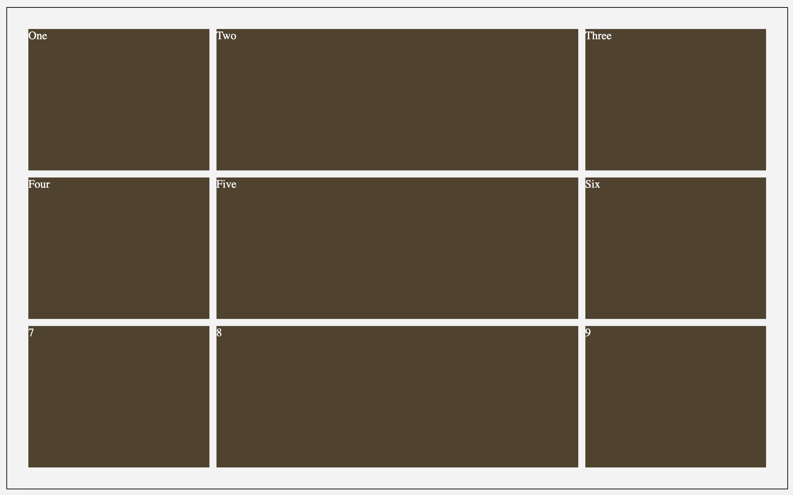

[Link to ChatGPT Record](https://chat.openai.com/share/399ba5eb-f691-412a-9d5f-1485120f2a6f)

**Problem #1 Grid-Gap**

As shown in the Exercise outline, I want to create an outer border to wrap Gallery A. But I cannot do it properly. 

At first, I wondered if my `padding` or `margin` didn't set properly.

I asked ChatGPT and explained that when `grid-gap` is applied, it actually creates gutters between the grid, so the overall dimensions of the grid container are expended. Thus, the outer border cannot show properly.

I took the second suggestion to wrap another container around the .wrapper-gallery-1 and apply the border to that container. 

The problem is solved.

**Problem #2**

In Gallery 2, I used `grid-area` to define each box's location. However, when it comes to the mobile version, I don't want to set each box once, so I asked ChatGPT how to do that in the simplest way.

And I learned how to reset and override those boxes in CSS.

```css
.itemA,
.itemB,
.itemC,
.itemD,
.itemE,
.itemF,
.itemG,
.itemH {
  grid-column: auto; /* Reset grid-column property */
  grid-row: auto; /* Reset grid-row property */
  grid-area: unset; /* Reset grid-area property */
}
```
